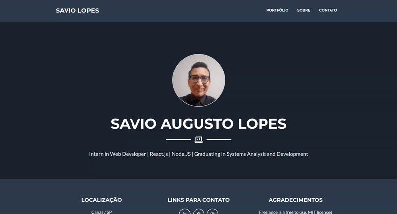

# Development Front-end using the Blade Laravel Framework

    

 

## Tópicos

[Tecnologias](#tecnologias)

[Instalação](#instalacao)

[Creditos de Tema](#creditos-de-tema)

 

## Tecnologias

Tecnologias e ferramentas utilizadas no desenvolvimento da aplicação:

- [Laravel](https://laravel.com/)
- [Bootstrap](https://getbootstrap.com/)

 

## Instalação

### Rodando o servidor
sudo docker compose up --build

### Instalando depedências
composer update

### Criando chave
php artisan key:generate

### Permissões
chmod -R 777 /var/www/php/ 

 

## 💜 Creditos de Tema

Template baseado no projeto open-source [startbootstrap-freelancer](https://github.com/startbootstrap/startbootstrap-freelancer).
